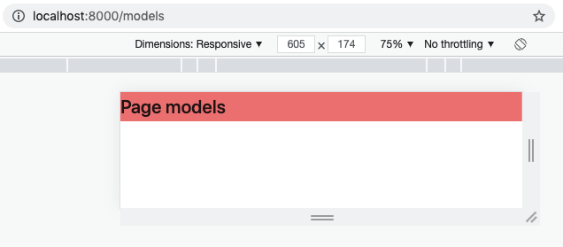

## 从零开始

### 1. 安装 Node.js

- https://nodejs.org/en/
- node-v16.13.1.pkg

```
$ node -v
---------
v16.13.1
```


### 2. 安装 Yarn

- https://yarnpkg.com/getting-started/install

```
$ corepack enable
```


### 3. 安装 Umi

新建项目文件夹：

```
$ mkdir myapp && cd myapp
```

新建 umi 应用：

```
$ yarn create @umijs/umi-app
----------------------------
yarn create v1.22.15
[1/4] 🔍  Resolving packages...
[2/4] 🚚  Fetching packages...
[3/4] 🔗  Linking dependencies...
[4/4] 🔨  Building fresh packages...
warning Your current version of Yarn is out of date. The latest version is "1.22.17", while you're on "1.22.15".
info To upgrade, run the following command:
$ curl --compressed -o- -L https://yarnpkg.com/install.sh | bash
success Installed "@umijs/create-umi-app@3.5.20" with binaries:
      - create-umi-app
Copy:  .editorconfig
Write: .gitignore
Copy:  .prettierignore
Copy:  .prettierrc
Write: .umirc.ts
Copy:  mock/.gitkeep
Write: package.json
Copy:  README.md
Copy:  src/pages/index.less
Copy:  src/pages/index.tsx
Copy:  tsconfig.json
Copy:  typings.d.ts
✨  Done in 509.10s.
```

安装 umi 应用的依赖：

```
$ yarn
------
yarn install v1.22.15
info No lockfile found.
[1/4] 🔍  Resolving packages...
[2/4] 🚚  Fetching packages...
[3/4] 🔗  Linking dependencies...
[4/4] 🔨  Building fresh packages...
success Saved lockfile.
$ umi generate tmp
Browserslist: caniuse-lite is outdated. Please run:
npx browserslist@latest --update-db

Why you should do it regularly:
https://github.com/browserslist/browserslist#browsers-data-updating
✨  Done in 436.19s.
```


### 4. 添加 Umi 页面和路由

新建 models 页面：

```
$ npx umi g page models --typescript
------------------------------------
Browserslist: caniuse-lite is outdated. Please run:
npx browserslist@latest --update-db

Why you should do it regularly:
https://github.com/browserslist/browserslist#browsers-data-updating
Write: src/pages/models.tsx
Write: src/pages/models.css
```

在“.umirc.ts”中配置路由：

```
import { defineConfig } from 'umi';

export default defineConfig({
  nodeModulesTransform: {
    type: 'none',
  },
  routes: [
    { path: '/', component: '@/pages/index' },
+   { path: '/models', component: '@/pages/models' },
  ],
  fastRefresh: {},
});
```

启动应用：

```
$ yarn start
------------
yarn run v1.22.15
$ umi dev
Browserslist: caniuse-lite is outdated. Please run:
npx browserslist@latest --update-db

Why you should do it regularly:
https://github.com/browserslist/browserslist#browsers-data-updating
Starting the development server...

✔ Webpack
  Compiled successfully in 8.29s
 DONE  Compiled successfully in 8293ms                                                        

  App running at:
  - Local:   http://localhost:8000 (copied to clipboard)
  - Network: http://172.20.10.2:8000
 WAIT  Compiling...         
 
✔ Webpack
  Compiled successfully in 312.89ms
 DONE  Compiled successfully in 313ms
```

测试新加的页面“http://localhost:8000/models”：



