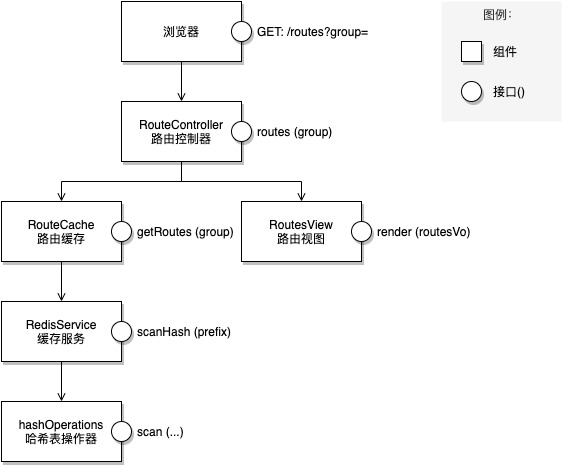

> 高效编码不是高速编码，而是在相同或更短的时间内交付质量更高、更易维护的代码。

首先简单介绍一下，高效编码的三个步骤：

## 1 编码的步骤

- 设计组件和接口：设计组件和组件之间交互的接口。
- 编写骨架代码：编写组件和接口的胶水代码，将组件搭建和组装起来。
- 编写实现代码：编写实现接口功能的具体代码。

闲话少叙，接下来，让我们通过一个案例来演示从设计到编码全过程。

## 2 案例实操

案例：对网关的路由表进行分组。

背景：由于历史原因公司存在两个网关系统，现在需要将它们进行合并，为了避免合并过程对业务产生影响，就需要分组小批量地迁移，于是就有了对路由进行分组的需求。

要求：

- 不修改现有的路由模型。
- 简单快速实现功能。

### 2.1 设计组件和接口

设计组件和组件之间交互的接口，如下图：



组件说明：

- RouteView 路由视图组件：渲染路由表页面。
- RouteController 路由控制器组件：查询路由表数据，通过视图组件渲染路由表。
- RouteCache 路由缓存组件：从缓存中高效读取路由表。
- RedisService 缓存服务组件：提供 Redis 通用缓存读写服务。
- hashOperations 哈希表操作器组件：提供 Redis 哈希表读写服务。

组件之间的依赖关系：

- 控制器主线：RouteController 依赖视图 RouteView 和路由数据缓存组件 RouteCache。
- 视图支线：Routeview 依赖路由数据 routes。
- 数据支线：RouteCache 依赖 RedisService，RedisService 依赖 hashOperations。

（如果依赖关系特别复杂，可以借助思维导图来梳理。）

组件与组件之间交互的接口：

通过梳理组件之间的依赖和交互关系，我们能快速准确的定义组件之间交互的接口：

- RouteController # routes(group)：路由控制器 # 分组展示路由表。
- RouteCache # getRoutes(group) ：路由缓存 # 获取指定分组的路由表。
- RedisService # scanHash(prefix) ：缓存服务 # 获取哈希表键中有指定前缀的子哈希表。
- hashOperations # scan(...) ：哈希表操作器 # 扫描哈希表。

组件接口设计基本原则：

- 在对的层次上做对的抽象：

| 组件 | 层次 | 功能 |
| --- | --- | --- |
| RouteController | MVC 中的控制器 | 协调 Model 数据与 View 视图的交互，控制哪些数据在哪个视图上进行展示 |
| RoutesView | MVC 中的视图 | 实现数据展示 |
| RoutesVO | MVC 中的模型 | 定义在视图中展示的数据模型 |
| RouteCache | 数据访问层 | 从缓存中高效读取路由表（业务相关） |
| RedisService | 缓存服务层 | 提供 Redis 通用缓存读写接口（与具体业务解耦） |
| hashOperations | 哈希表操作器 | 提供 Redis 哈希表读写接口 |

- 每个接口只做一件事：

| 接口 | 组件 | 职责 |
| --- | --- | --- |
| routes (group) | RouteController | 查询并展示某分组的路由表 |
| getRoutes (group) | RouteCache | 从缓存中查询某分组的路由表 |
| scanHash (prefix) | RedisService | 扫描 Redis 哈希表键中有指定前缀的子哈希表 |
| scan (...) | hashOperations | 扫描 Redis 哈希表（通用方法） |

### 2.2 编写骨架代码

通过第 1 步的组件和接口设计，我们能快速的编写各个组件的骨架代码：

（1）RouteController # routes (group)：查询并展示某分组的路由表

```
public Mono<String> routes (final Model model,
                            @QueryParam("group") String group) {
  // TODO: 1.1 按分组获取路由表：routeCache.getRouteMap(group): Map<routeId, routeDefinition>
  // TODO: 1.2 将路由缓存模型转换为路由视图模型：routeVoTransfer.from(RouteDefinition): RouteVO
  // TODO: 1.3 构造路由表视图模型：buildRoutesVo(routeVoList): RoutesVO
  // TODO: 1.4 渲染视图
}
```

（2）RouteCache # getRoutes (group)：从缓存中查询某分组的路由表

```
public Map<String, RouteDefinition> getRoutes (String group) {
  // TODO: 2.1 扫描有带有分组前缀的缓存字典：redisService.scanHash(KEY, group)
  // TODO: 2.2 反序列化缓存路由表：routeDefinitionTransfer.from(RouteJson): RouteDefinition
}
```

（3）RedisService # scanHash：扫描 Redis 哈希表键中有指定前缀的子哈希表

```
public Map<String, Object> scanHash (String key, String prefix, long limit) {
  // TODO: 3.1 构造 scanOptions
  // TODO: 3.2 扫描哈希表：hashOperations.scan(key, scanOptions)
}
```

### 2.3 编写实现代码

代码实现逻辑不是本文讨论的重点，所以此处省略具体的实现代码。

## 3 高效的奥秘

整个编码过程实际花费的时间，比我预估的时间至少缩短了 50%，预估 8 小时其实不到 4 小时就完成了。

其中的奥秘其实很简单：

- 理顺思路：利用系统结构化思维推演、理顺了整个流程的思路

先理顺全局思路，那么在进入局部的时候，只需要专注于局部的设计。

- 分而治之，各个击破

对系统进行整体分析，把系统分解为组件和接口，本质上是把一个大问题切分成了一个个小问题，每次只解决一个小问题，难度变小，效率也会变高。

- 纸上谈兵：最小化试错成本

相比于一开始就编写代码并在编码的过程中修正设计，在设计稿中修改设计的成本要低得多，而且很多错误，在系统设计阶段就能够避免，因此先设计可以少走很多弯路。

- 持久的编码上下文：无惧打断

被打断是编程最大的挑战，切换工作上下文的损耗太大了！人脑无法像电脑那样快速的切换线程上下文，况且我们也不可能在打断时存档上下文，所以切换回来时，我们要先回到断点，然后重组上下文，接着思考下一步要怎么做，进而才能接着往下做。

相对的，提前做设计，不仅是理清思路，选对方向，更重要的是它持久化了编码上下文，有了固化的设计稿，无论如何频繁的打断，我们都能快速找到断点、切回上下文、迅速进入编码状态。

## 4 后记

这套方法论不仅能够提高编码的效率，同时也能锻炼系统设计能力、文档编写能力。

设计方法就像三体世界中的一片二向箔，它能够对复杂的编码问题进行降维打击；二向箔看起来平平无奇，实则蕴含着无穷的力量。

