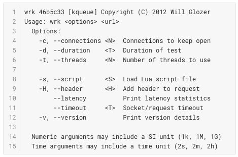

压力测试是后端程序员的必备技能，很多工作场景都需要用到这项技能，如果你还不会，那就现在马上学习实践起来，以便不时之需。

## 五分钟上手压测

### 安装压测工具：四分钟

提前安装好一个趁手的压测工具，Wrk 是现代的压测工具，小巧实用。

Wrk 是 C 语言写就的压测工具，所以编译安装需要花些时间，你懂的。（只能在类 Unix 操作系统安装）

安装成功的话会显示 Wrk 的版本信息：

### “一句话”压测：半分钟

简单尝试一下 Wrk 功能，如：

上面这条命令的含义：使用 1 个线程，创建 1 个并发连接，对百度首页进行 10 秒钟的压测，压测结束后打印出延迟分区报告。其中，每个参数的含义：

-   `wrk`：Wrk 压测工具压测命令。
-   `-t`：并发线程数量，这里简单设置为 1。
-   `-c`：并发连接数，这里简单设置为 1。
-   `-d`：压测时长，这里设置为 10 秒钟。
-   `https://www.baidu.com` 压测目标地址。
-   `--latency` 输出延迟分区报告。

### “秒懂”压测报告：半分钟

上面的压测命令执行完成后，会输出压测报告，如下所示：

我们来逐行解读一下：

-   第 1 行：压测时间和压测目标地址。
-   第 2 行：线程数和并发连接数。
-   第 3~5 行：平均每个线程的压测数据；第 3 行是标题，有平均值、标准差、最大值、正负标准差这 4 种统计方式；第 4 行是延迟数据；第 5 行是每秒请求数。
-   第 6~10 行：延迟分区报告。当指定 `--latency` 参数时才会输出延迟分区报告。从 50%，75%，90%，99% 这 4 个区域统计延迟时间。所以叫延迟分区报告。
-   第 11 行：请求数，压测时长，下行流量。
-   第 12 行：每秒请求数，也就是每秒吞吐量，业界俗称 QPS
-   第 13 行：每秒上行流量。

总的来说还是非常简单明了的，是不是？

## 理解压测关键指标

无论使用何种压测工具，每次压测后都可以得到这 3 个关键指标：并发连接数，吞吐量（QPS），延迟。

### 并发连接数

要理解并发连接数，首先要理解连接，它是指客户端向服务端发起请求时建立的 TCP 连接，那并发连接数就是在一段时间内客户端与服务端的 TCP 连接数。如，C10K问题，就是指服务端一秒能处理一万个连接的能力。

在压测中，并发连接数这个参数到底有什么意义？想象一下你正在车站排队买票，车站只开了一个售票窗口，队伍越来越长，车站里甚至出现了拥堵，站长看到拥堵的情况后增加了几个窗口，于是队伍迅速地缩短了几倍，你也很快买到了车票，车站人流也顺畅了很多。

你看，这就是并发窗口数发挥了作用。

并发窗口数与并发连接数是一样的道理，窗口数影响售票数，而连接数影响请求数。

所以，在压测时，我们可以通过增加并发连接数来增大压测的请求数，通过不断地加压来测试软件的最大处理能力。

这就像在举重比赛中，不断增加杠铃的重量，哪个选手能坚持到最后，就获得冠军。

### 吞吐量/请求数

吞吐量/请求数是指一段时间内，客户端向服务端发起请求并获得响应的数量。

### 延迟/响应时间

延迟/响应时间一般是指一段时间内，请求从发起到得到响应消耗的平均时间。

出于准确性的考虑，我们还会综合考量延迟分布情况，一般是从前 99%、前 90%、前 75%、前 50%这几个分区进行统计。进行分区统计的原因在于，当少数的慢请求延迟非常高时，会直接影响平均延迟，这时平均延迟就无法准确地反应整体响应指数了，所以分区统计提供了更全面可靠的参考系。

## 分析性能瓶颈

通过逐步增加并发连接数，在多次加压之后，我们可以绘制出“并发连接与吞吐量趋势图”，和“延迟与吞吐量趋势图”：

结合这两张图，我们能够很直观地解读出软件系统的性能瓶颈。

在“并发连接与吞吐量”的图中，吞吐量的峰顶处对应的并发连接数，就是系统能处理的极限并发连接数了。

而在“延迟与吞吐量”的图中，在吞吐量颓势未显时达到设定的最大延迟处，就是系统的最大吞吐量了。

下面来简单总结一下，并发连接数、吞吐量、延迟之间的关系：

-   并发连接数与吞吐量成正比。如果随着并发数的增加，吞吐量不再提升甚至开始下降，说明已经达到系统吞吐量的极限值。
-   吞吐量与响应延迟成正比。当响应时间触达阈值，此时的吞吐量为系统的极限值。
-   吞吐量极限需要综合考虑并发连接数和延迟的数值。
-   并发连接数是影响吞吐量的关键性变量，通过阶段性提高并发连接数测试出系统吞吐量的极限。
-   当然，以上讨论的前提是，系统请求成功率符合预期（一般是 95% 以上）。

以上，就是压力测试的一些基础入门知识。

