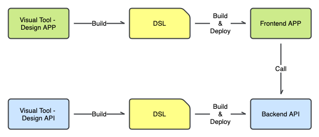

## 资料

### [What is Low-Code | IBM](https://www.ibm.com/cloud/learn/low-code)

Learn about low-code, an app development process that focuses on visual development and interfaces, to enable quick app delivery with little hand-coding.

Low-Code 是一种专注于可视化开发、可视化接口，以少量代码编写实现快速应用交付的应用开发模式。

### [Search | ThoughtWorks](https://www.thoughtworks.com/search?q=low+code&c=sitewide)

### [全球低代码平台开发资源大全](https://github.com/steedos/awesome-low-code)

## 方案

### [PyCaret](https://github.com/pycaret/pycaret)

### [Node-RED](https://github.com/node-red/node-red)

### [Lowdefy](https://github.com/lowdefy/lowdefy)

## 工作原理

核心思想：将领域知识抽象和精炼成领域专用语言 DSL，通过可视化工具辅助构造和生成 DSL，然后基于 DSL 编译和生成应用程序代码，最后通过 CI/CD 工具自动集成和部署应用程序。

DSL 是 Low-Code 得以实现和高效运行的关键，可视化和自动化则是 Low-Code 提升效能的核心法门。

