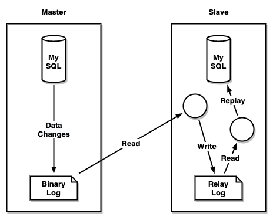
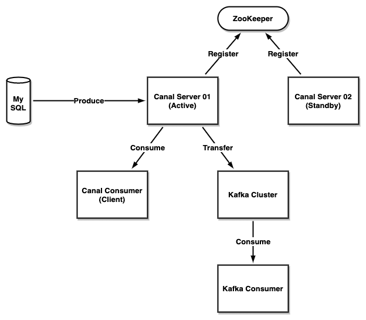

## 主要功能

- 基于MySQL增量日志解析，提供增量数据订阅和消费。
- 支持MySQL版本：5.1.x，5.5.x，5.6.x，5.7.x，8.0.x。

## 工作原理

### MySQL主备复制原理

- MySQL Master将数据变更写入Binary Log，记录为Binary Log Events。
- MySQL Slave将Binary Log同步到它的Relay Log。
- MySQL Slave重放Relay Log Events，将数据变更反映成它自己的数据。

### Canal工作原理

- Canal伪装成MySQL Slave向MySQL Master发送dump协议。
- MySQL Master收到dump请求，推送Binary Log给Canal。
- Canal解析Binary Log Events对象。

## Canal架构

### 组件和架构

